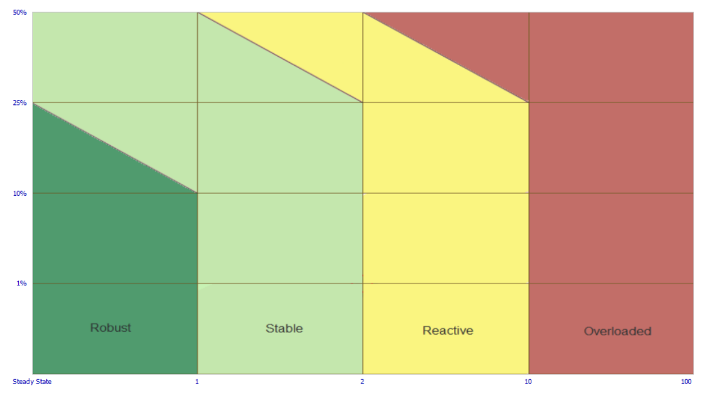

# ProcessVueAlarmZones

ASP.NET Core 8 MVC application that classifies plant alarm performance zones using the **EEMUA 191 Rev 3 chart**.



## Features

- **Clean Architecture** layout:
  - `Domain`: Core entities (`Zone` enum)
  - `Application`: Classifier logic (`EemuaZoneClassifier`) + config
  - `Web`: ASP.NET Core MVC frontend (form + validation)
  - `Tests`: xUnit tests for classifier and boundaries

- **Geometry-exact classifier**  
  Implements 3 vertical cutoffs (x=1,2,10) and 3 sloped boundaries:
  - (0,25) → (1,10) (Robust roof)
  - (1,50) → (2,25) (Stable/Reactive split)
  - (2,50) → (10,25) (Reactive/Overloaded split)

  - **Linear equation calculation**  
  Each sloped boundary is represented as a straight line `y = mx + b`:
  - `m` = slope = rise/run between two points  
  - `b` = y-intercept (where the line crosses the y-axis)  
  Example: the Robust/Stable roof line through (0,25) and (1,10) → slope = -15, intercept = 25 → `y = -15x + 25`.

- **Options pattern** for configuration (thresholds and line definitions via `appsettings.json`).
- **MVC Web frontend** with jQuery unobtrusive validation.
- **xUnit tests** for classifier edge cases.

---

## Getting Started

### 1. Clone repo
```bash
git clone https://github.com/sgr-0007/ProcessVueAlarmZones.git
cd ProcessVueAlarmZones
```

### 2. Build solution
```bash
dotnet build
```

### 3. Run tests
```bash
dotnet test
```

### 4. Run web app
```bash
dotnet run --project src/ProcessVueAlarmZones.Web
```

Visit: http://localhost:5257 (or shown port)

---

## Example Classification

| Input (X,Y)         | Zone       |
|---------------------|------------|
| (0.5, 15)           | Robust     |
| (0.5, 20)           | Stable     |
| (1.5, 30)           | Stable     |
| (1.5, 40)           | Reactive   |
| (3.0, 20)           | Reactive   |
| (3.0, 60)           | Overloaded |
| (10.0, 25)          | Reactive   |
| (11.0, 10)          | Overloaded |

---

## Project Layout

```
ProcessVueAlarmZones/
├─ src/
│  ├─ ProcessVueAlarmZones.Domain/       # Zone enum
│  ├─ ProcessVueAlarmZones.Application/  # Classifier, Config, Interfaces
│  ├─ ProcessVueAlarmZones.Web/          # MVC frontend
├─ tests/
│  └─ ProcessVueAlarmZones.Tests/        # xUnit tests
└─ README.md
```
